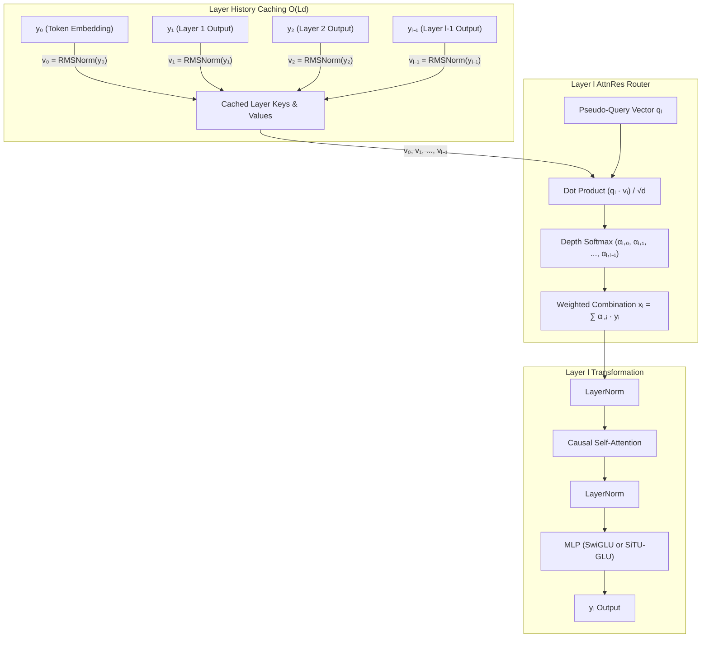
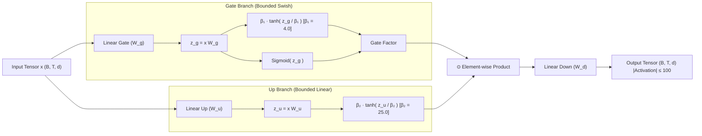

# SSF-AttnRes & SiTU-GLU Research Framework

A lightweight, high-performance research framework built on top of nanoGPT evaluating standard Pre-Norm Transformer (Baseline), Attention Residuals (**+AttnRes**), **SiTU-GLU** (Kimi K3 Eq. 12), and their combination (**+Both**) on a ~50M parameter Language Model trained on FineWeb-Edu.

Designed to run seamlessly on Kaggle GPUs (T4 / P100 / V100 / A100).

---

## 1. Architectural Highlights & Variant Overview

| Variant # | Name | Description | Key Formula / Spec |
|---|---|---|---|
| 0 | **Baseline** | Pre-Norm Residual + SwiGLU | $x \leftarrow x + \text{attn}(\text{LN}(x))$, $\text{SwiGLU}(x) = (\text{SiLU}(x W_g) \odot x W_u) W_d$ |
| 1 | **+AttnRes** | Full Attention Residuals | Depth attention routing: $x_l = \sum \alpha_{l, i} \cdot y_i$, cached key projections ($O(Ld)$) |
| 2 | **+SiTU** | SiTU-GLU MLP | $\left[ \beta_1 \tanh\left(\frac{W_g x}{\beta_1}\right) \odot \text{Sigmoid}(W_g x) \right] \odot \left[ \beta_2 \tanh\left(\frac{W_u x}{\beta_2}\right) \right] W_d$ |
| 3 | **+Both** | AttnRes + SiTU-GLU | Combined depth attention routing & bounded SiTU-GLU activation |

---

## 2. Model Architecture & Algorithm Diagrams

### 2.1 Full Attention Residuals (+AttnRes) Depth Routing

Instead of standard additive residual accumulation ($h_{l+1} = h_l + f_l(h_l)$), **AttnRes** dynamically retrieves representations from the embedding $h_0$ and all preceding layer outputs $[y_0, y_1, \dots, y_{l-1}]$ using learnable pseudo-query vectors $q_l$.



---

### 2.2 Sigmoid Tanh Unit GLU (SiTU-GLU) Architecture (Kimi K3 Eq. 12)

**SiTU-GLU** prevents activation explosion in low-precision arithmetic by applying smooth softcapping $\beta \tanh(z / \beta)$ to both the gate and up branches of the GLU.



---

### 2.3 Comprehensive 4-Variant Model Comparison

```mermaid
graph TB
    subgraph Variant0 ["0. Baseline (Standard Pre-Norm Transformer)"]
        x0["x"] --> Ln01["LN"] --> Attn0["Self-Attn"] --> Add01["+"] --> Ln02["LN"] --> SwiGLU0["SwiGLU"] --> Add02["x_next"]
        x0 --> Add01
        Add01 --> Add02
    end

    subgraph Variant1 ["1. +AttnRes (Full Attention Residuals)"]
        History1["[y₀, y₁, ..., yₗ₋₁]"] --> AttnRes1["AttnRes Depth Router (qₗ)"]
        AttnRes1 --> x1["xₗ (Weighted Sum)"]
        x1 --> Ln11["LN"] --> Attn1["Self-Attn"] --> Add11["+"] --> Ln12["LN"] --> SwiGLU1["SwiGLU"] --> y1["yₗ Output"]
        x1 --> Add11
        Add11 --> y1
    end

    subgraph Variant2 ["2. +SiTU (SiTU-GLU Bounded Activation)"]
        x2["x"] --> Ln21["LN"] --> Attn2["Self-Attn"] --> Add21["+"] --> Ln22["LN"] --> SiTU2["SiTU-GLU (Eq. 12)"] --> Add22["x_next"]
        x2 --> Add21
        Add21 --> Add22
    end

    subgraph Variant3 ["3. +Both (AttnRes + SiTU-GLU)"]
        History3["[y₀, y₁, ..., yₗ₋₁]"] --> AttnRes3["AttnRes Depth Router (qₗ)"]
        AttnRes3 --> x3["xₗ (Weighted Sum)"]
        x3 --> Ln31["LN"] --> Attn3["Self-Attn"] --> Add31["+"] --> Ln32["LN"] --> SiTU3["SiTU-GLU (Eq. 12)"] --> y3["yₗ Output"]
        x3 --> Add31
        Add31 --> y3
    end
```



---

## 3. Quickstart & Verification

### Run Unit Tests
```bash
pytest tests/
```

### Check Experiment Matrix Status
```bash
python scripts/run_matrix.py --status
```

### Run Full 1B Token Experiment Matrix
```bash
python scripts/run_matrix.py --run-all-pending
```

### Generate Table 1 & Figures 1-2
```bash
python scripts/analyze_results.py
```

---

## 4. Running the 12-Run Experiment Matrix (1B Tokens Each)

All outputs (manifest, checkpoints, metric CSVs, figures, and summary tables) are automatically saved inside the **`output/`** directory. Checkpoints (`best.pt` & `latest.pt`) are updated every **2,000 steps** to maintain a compact storage footprint (~240 MB per run).

### 4.1 Run All 12 Experiments Sequentially (1B Tokens Each)
```bash
python scripts/run_matrix.py --run-all-pending --target-tokens 1000000000
```

### 4.2 Run Individual 1B Token Experiments

#### **Variant 0: Baseline (Pre-Norm + SwiGLU)**
```bash
python scripts/run_matrix.py --variant baseline --seed 42 --target-tokens 1000000000
python scripts/run_matrix.py --variant baseline --seed 1337 --target-tokens 1000000000
python scripts/run_matrix.py --variant baseline --seed 2024 --target-tokens 1000000000
```

#### **Variant 1: +AttnRes (Full Attention Residuals)**
```bash
python scripts/run_matrix.py --variant attn_res --seed 42 --target-tokens 1000000000
python scripts/run_matrix.py --variant attn_res --seed 1337 --target-tokens 1000000000
python scripts/run_matrix.py --variant attn_res --seed 2024 --target-tokens 1000000000
```

#### **Variant 2: +SiTU (SiTU-GLU Bounded Activation)**
```bash
python scripts/run_matrix.py --variant situ_glu --seed 42 --target-tokens 1000000000
python scripts/run_matrix.py --variant situ_glu --seed 1337 --target-tokens 1000000000
python scripts/run_matrix.py --variant situ_glu --seed 2024 --target-tokens 1000000000
```

#### **Variant 3: +Both (AttnRes + SiTU-GLU)**
```bash
python scripts/run_matrix.py --variant both --seed 42 --target-tokens 1000000000
python scripts/run_matrix.py --variant both --seed 1337 --target-tokens 1000000000
python scripts/run_matrix.py --variant both --seed 2024 --target-tokens 1000000000
```

---

### 4.3 Kaggle Output Zip & Cleanup Workflow

In Kaggle notebook cells, execute individual experiments, zip the output folder for 1-click download, and clean up before starting the next run:

```python
# 1. Execute target 1B token experiment
!python scripts/run_matrix.py --variant baseline --seed 42 --target-tokens 1000000000

# 2. Compress output folder to zip
!zip -r output_baseline_seed42.zip output/

# 3. Clean up local output folder
!rm -rf output/
```
