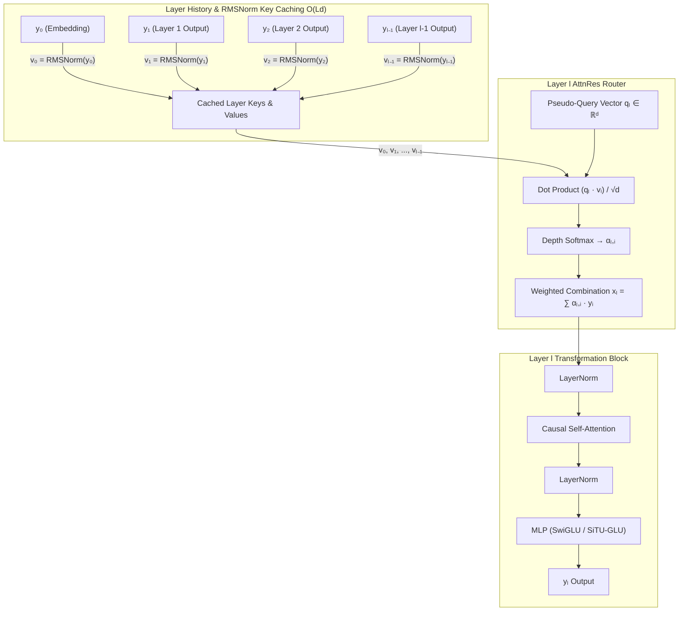
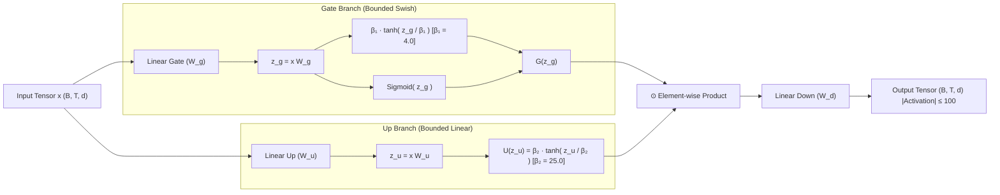

# SSF-AttnRes & SiTU-GLU Research Framework: Main Research Idea & Overview

## 1. Executive Summary & Core Motivation

Deep Transformer architectures have revolutionized natural language processing, but state-of-the-art designs still face two fundamental structural bottlenecks:

1. **Residual Stream Rigidity & Layer Lock-in**: Standard Pre-Norm Transformers rely on simple additive residual accumulation ($x_{l+1} = x_l + f_l(x_l)$). As model depth increases, early-layer representations become increasingly diluted or overwritten, restricting dynamic information flow across distant layers and causing identity lock-in.
2. **Activation Explosion in Low-Precision Training**: Modern SwiGLU and GeGLU activations exhibit unbounded dynamic ranges. When training in half-precision (FP16 or BF16), un-normalized intermediate activations can produce extreme value spikes ($>10^3$), triggering gradient instability, loss spikes, or numeric overflow (NaNs).

This project presents **SSF-AttnRes** (Sequential Dynamic Attention Residuals) combined with **SiTU-GLU** (Sigmoid Tanh Unit Gated Linear Unit, derived from Kimi K3 Technical Report Eq. 12). Together, these innovations create a scalable, parameter-efficient language model architecture (~50M parameters) evaluated across a rigorous 1B-token FineWeb-Edu training matrix.

---

## 2. Theoretical Foundations & Core Innovations

### 2.1 Full Attention Residual Routing (+AttnRes)

Rather than enforcing rigid sequential addition, **AttnRes** introduces dynamic softmax depth-attention routing across all prior layer representations $[y_0, y_1, \dots, y_{l-1}]$, where $y_0 = h_0$ represents the initial token plus positional embedding.

**Key Advantages of AttnRes**:
- **Dynamic Depth Routing**: Enables layer $l$ to selectively extract features directly from early embedding layers $y_0$ or any intermediate layer $y_i$ without degradation.
- **Key-Cached $O(Ld)$ Efficiency**: By caching normalized key vectors $v_i = \text{RMSNorm}(y_i)$, computing depth routing for layer $l$ requires only $O(l \cdot d)$ operations instead of re-normalizing and re-projecting historical states.

---

### 2.2 Sigmoid Tanh Unit GLU (+SiTU-GLU)

Derived from the Kimi K3 Technical Report (Equation 12), **SiTU-GLU** introduces smooth hyperbolic softcapping to both the gate and up projection branches of the GLU block.

**Key Advantages of SiTU-GLU**:
- **Bounded Pre-Projection Range**: Guarantees that pre-down-projection activations satisfy $|G(z_g) \odot U(z_u)| \le \beta_1 \cdot \beta_2 = 4.0 \times 25.0 = 100.0$.
- **Numerical Softcapping**: Completely prevents gradient explosion and loss spikes in FP16/BF16 low-precision training without sacrificing non-linear expressivity.

---

## 3. Four Core Model Variants

To systematically isolate the empirical gains of each component, the framework establishes a $2 \times 2$ factorial experiment matrix consisting of 4 distinct variants:

| Variant ID | Name | Depth Residual Stream | MLP Architecture | Primary Hypotheses Evaluated |
| :--- | :--- | :--- | :--- | :--- |
| `0` | **Baseline** | Standard Pre-Norm Addition ($x + f(x)$) | SwiGLU ($\text{SiLU}(x W_g) \odot x W_u$) | Standard baseline benchmark (nanoGPT style) |
| `1` | **+AttnRes** | Full Attention Residual Routing ($q_l \cdot \text{RMSNorm}(y_i)$) | SwiGLU | Tests representation improvement via dynamic depth routing |
| `2` | **+SiTU** | Standard Pre-Norm Addition ($x + f(x)$) | SiTU-GLU ($\text{Eq. 12 softcapping}$) | Tests training stability & gradient health from bounded MLP activations |
| `3` | **+Both** | Full Attention Residual Routing | SiTU-GLU | Tests combined synergistic stability and convergence acceleration |

---

## 4. Key Scientific & Architectural Contributions

1. **Parameter-Neutral Innovations**: Neither AttnRes (only $L \times d$ parameters for $q_l$) nor SiTU-GLU adds significant parameter overhead, ensuring fair comparison at ~50M parameter scale.
2. **Low-Precision FP16 Stability**: Solves activation explosion in standard Transformer MLPs through mathematical softcapping bounds.
3. **Rigorous Empirical Diagnostic Telemetry**: To scientifically verify divergence root causes rather than assuming them, the trainer measures per-step **activation maxima** ($\|x\|_\infty$), **gradient norm distributions** ($\|g\|_2$), **parameter norms** ($\|\theta\|_2$), **AMP GradScaler scale factors**, and explicit **non-finite (NaN/Inf) step flags**.
4. **Rigorous Multi-Seed Verification**: All 4 variants are trained across 3 distinct random seeds (`42`, `1337`, `2024`) over 1,000,000,000 (1B) tokens of FineWeb-Edu dataset to guarantee statistical significance.
