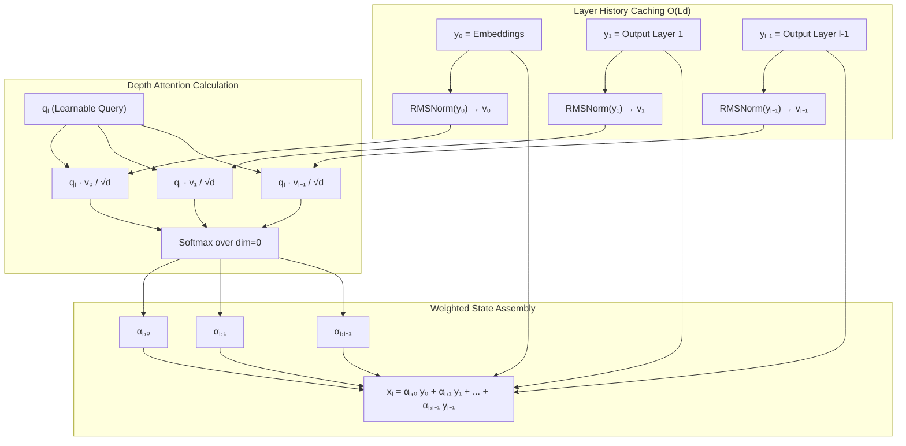
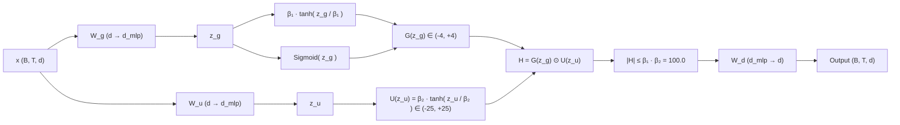

# SSF-AttnRes & SiTU-GLU Research Framework: Technical & Architectural Specifications

## 1. Executive Specification & Model Parameters

The architecture is built upon a ~50M parameter causal language model designed for efficient multi-GPU training and clean modular experimentation.

| Hyperparameter | Symbol | Value | Notes / Description |
| :--- | :--- | :--- | :--- |
| Vocabulary Size | $V$ | `50,257` | Tiktoken GPT-2 BPE Tokenizer |
| Context Window Length | $T$ | `512` | Sequence length block size |
| Model Hidden Dimension | $d_{\text{model}}$ | `512` | Base embedding & hidden size ($d$) |
| Number of Layers | $L$ | `6` | Transformer block depth |
| Number of Attention Heads | $H$ | `8` | Multi-head self-attention heads |
| Head Dimension | $d_{\text{head}}$ | `64` | $d_{\text{head}} = d_{\text{model}} / H = 512 / 8$ |
| MLP Hidden Dimension | $d_{\text{mlp}}$ | `1344` | LLaMA 8/3 scaling: $\frac{8}{3} d = 1365.3 \to 1344$ (multiple of 64) |
| Dropout Rate | $p_{\text{drop}}$ | `0.0` | Disabled for clean deterministic convergence |
| Linear Projection Bias | `bias` | `False` | Biases omitted across projections |
| Total Non-Embedding Params | $N_{\text{param}}$ | `~50.2M` | Weight tied $W_{te}$ and $W_{lm\_head}$ |

---

## 2. Full Attention Residuals (+AttnRes) Detail

### 2.1 Mathematical Formulation

In traditional Pre-Norm Transformers, layer history is accumulated additively:
$$h_{l+1} = h_l + f_l(\text{LN}(h_l))$$

**AttnRes** replaces this with dynamic softmax depth-attention. For layer $l \in \{0, 1, \dots, L-1\}$, the input representation $x_l$ is computed over all preceding outputs $[y_0, y_1, \dots, y_{l-1}]$, where $y_0 = h_0$ is the token + positional embedding tensor.

1. **RMSNorm Key Normalization**:
   $$v_i = \text{RMSNorm}(y_i) = \frac{y_i}{\sqrt{\frac{1}{d} \sum_{k=1}^d y_{i, k}^2 + \epsilon}} \odot \gamma, \quad \forall i \in \{0, 1, \dots, l-1\}$$

2. **Pseudo-Query Depth Scoring**:
   Each layer $l$ maintains a learnable pseudo-query vector $q_l \in \mathbb{R}^d$. Unnormalized logit score $z_{l, i}$ for historical layer $i$ is:
   $$z_{l, i} = \frac{q_l^T v_i}{\sqrt{d}}$$

3. **Depth Softmax & Weighted Aggregation**:
   $$\alpha_{l, i} = \frac{\exp(z_{l, i})}{\sum_{j=0}^{l-1} \exp(z_{l, j})}, \quad x_l = \sum_{i=0}^{l-1} \alpha_{l, i} \cdot y_i$$

### 2.2 Incremental Key Caching ($O(Ld)$ Complexity)

Re-normalizing and re-projecting historical outputs at every layer would require $O(L^2 d)$ overhead per token. AttnRes avoids this by maintaining an incremental cache of $v_i = \text{RMSNorm}(y_i)$ alongside $y_i$.

- **Memory Overhead**: Caching $L$ tensors of shape `(B, T, d)` per forward pass.
- **Compute Complexity**: Summing $l$ dot products of dimension $d$ requires only $O(l \cdot d)$ operations per layer, yielding total depth routing complexity of $\sum_{l=1}^L l \cdot d = \frac{L(L+1)}{2} d \approx O(L^2 d)$ across all layers, but with a negligible constant factor compared to matrix multiplications.

---

## 3. Sigmoid Tanh Unit GLU (SiTU-GLU) Detail

### 3.1 Mathematical Formulation (Kimi K3 Eq. 12)

Standard SwiGLU defines:
$$\text{SwiGLU}(x) = \left( \text{SiLU}(x W_g) \odot (x W_u) \right) W_d$$

As $x W_u$ can grow arbitrarily large, un-normalized GLU output can explode. **SiTU-GLU** applies hyperbolic tangent softcapping with parameters $\beta_1 = 4.0$ and $\beta_2 = 25.0$:

1. **Linear Gate & Up Projections**:
   $$z_g = x W_g \in \mathbb{R}^{B \times T \times d_{\text{mlp}}}, \quad z_u = x W_u \in \mathbb{R}^{B \times T \times d_{\text{mlp}}}$$

2. **Bounded Gating Branch $G(z_g)$**:
   $$G(z_g) = \left( \beta_1 \cdot \tanh\left( \frac{z_g}{\beta_1} \right) \right) \odot \sigma(z_g), \quad \beta_1 = 4.0$$

3. **Bounded Up Branch $U(z_u)$**:
   $$U(z_u) = \beta_2 \cdot \tanh\left( \frac{z_u}{\beta_2} \right), \quad \beta_2 = 25.0$$

4. **Element-wise Combination & Down Projection**:
   $$H = G(z_g) \odot U(z_u), \quad \text{SiTU-GLU}(x) = H W_d$$

### 3.2 Proof of Activation Bound

Since $|\tanh(\theta)| < 1$ for all $\theta \in \mathbb{R}$ and $0 < \sigma(\theta) < 1$:
$$|G(z_g)| = \beta_1 \left| \tanh\left( \frac{z_g}{\beta_1} \right) \right| \sigma(z_g) < \beta_1 \cdot 1 \cdot 1 = 4.0$$
$$|U(z_u)| = \beta_2 \left| \tanh\left( \frac{z_u}{\beta_2} \right) \right| < \beta_2 \cdot 1 = 25.0$$
$$\therefore |H| = |G(z_g) \odot U(z_u)| < \beta_1 \cdot \beta_2 = 4.0 \times 25.0 = 100.0$$

Thus, intermediate activations before matrix multiplication $W_d$ are strictly bounded within $[-100.0, +100.0]$, ensuring complete numerical stability under half-precision (FP16/BF16) arithmetic.

---

## 4. Parameter and FLOP Budget Analysis

### 4.1 Parameter Count Breakdown

- **Token Embeddings ($W_{te}$)**: $V \times d = 50,257 \times 512 = 25,731,584$
- **Positional Embeddings ($W_{pe}$)**: $T \times d = 512 \times 512 = 262,144$
- **Attention Layers ($L \times 4 d^2$)**: $6 \times 4 \times 512^2 = 6,291,456$
- **MLP Projections ($L \times 3 d d_{\text{mlp}}$)**: $6 \times 3 \times 512 \times 1344 = 12,386,304$
- **AttnRes Pseudo-Queries ($L \times d$)**: $6 \times 512 = 3,072$ (Negligible $+0.006\%$)
- **LM Head ($W_{lm\_head}$)**: Tied with $W_{te}$ (0 additional params)

### 4.2 FLOPs Per Token Calculation

Theoretical FLOPs per token (forward + backward pass) are estimated via:
$$\text{FLOPs/token} = 6 N_{\text{param}} + 12 L H d_{\text{head}} T + \mathbf{1}_{\text{AttnRes}} \cdot L (L+1) d$$

For $N \approx 50.2\text{M}, L=6, H=8, d_{\text{head}}=64, T=512, d=512$:
- **Base FLOPs**: $6 \times 50.2\text{M} = 301.2\text{M}$
- **Causal Attention KV FLOPs**: $12 \times 6 \times 8 \times 64 \times 512 = 18.87\text{M}$
- **AttnRes Depth Routing FLOPs**: $6 \times 7 \times 512 = 21,504$ (Negligible $+0.007\%$)

---

## 5. PyTorch Structural Code Mapping

| Mathematical Concept | Implementation Module | Source File |
| :--- | :--- | :--- |
| Model Configuration & Switches | `GPTConfig` | [config/model_config.py](file:///e:/SSF-AttnRes/config/model_config.py) |
| RMSNorm Layer Normalization | `LayerRMSNorm` | [models/attn_res.py](file:///e:/SSF-AttnRes/models/attn_res.py#L7-L17) |
| Depth Attention Router | `AttnResRouter` | [models/attn_res.py](file:///e:/SSF-AttnRes/models/attn_res.py#L19-L60) |
| Standard SwiGLU MLP | `SwiGLU` | [models/mlp.py](file:///e:/SSF-AttnRes/models/mlp.py#L7-L25) |
| Softcapped SiTU-GLU MLP | `SiTUGLU` | [models/mlp.py](file:///e:/SSF-AttnRes/models/mlp.py#L28-L63) |
| Full Transformer Assembly | `GPT` | [models/gpt.py](file:///e:/SSF-AttnRes/models/gpt.py#L36-L191) |
