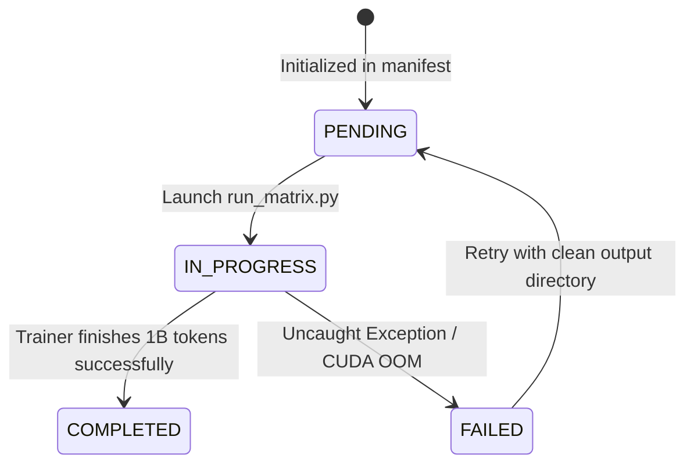

# SSF-AttnRes & SiTU-GLU Research Framework: Experiment Matrix, Execution Commands & Schedule

## 1. 12-Run Experiment Matrix Specification

To produce statistically reliable and publishable research findings, every model variant is trained across **three independent random seeds** on **1 Billion tokens** from FineWeb-Edu.

### 1.1 Hyperparameter & Schedule Matrix

| Parameter | Value | Details / Derivation |
| :--- | :--- | :--- |
| **Micro-Batch Size** | `16` | Per-GPU forward batch size (fits comfortably in 6.5 GB VRAM) |
| **Context Window ($T$)** | `512` | Token sequence length per sample |
| **Gradient Accumulation** | `8` | Accumulates 8 micro-batches per optimization step |
| **Tokens Per Step** | `65,536` | $\text{Batch} (16) \times \text{Context} (512) \times \text{Accum} (8) = 65,536$ |
| **Target Token Budget** | `1,000,000,000` | 1 Billion tokens per run |
| **Total Iterations / Run** | `15,258` | $\lceil 1,000,000,000 / 65,536 \rceil = 15,258$ steps |
| **Peak Learning Rate** | `3e-4` | AdamW optimizer ($\beta_1=0.9, \beta_2=0.95$, weight decay $= 0.1$) |
| **LR Warmup** | `1,000` steps | Linear warmup from $0 \to 3\text{e-}4$ |
| **LR Decay** | `15,258` steps | Cosine decay down to min LR $3\text{e-}5$ |
| **Checkpoint Interval** | `2,000` steps | Saves `best.pt` & `latest.pt` (~240 MB footprint) |

---

### 1.2 Full 12-Run Matrix Manifest

| Run Key | Variant | Seed | Target Tokens | Max Iterations | Output Folder |
| :--- | :--- | :--- | :--- | :--- | :--- |
| `baseline_seed42` | `baseline` | `42` | 1,000,000,000 | 15,258 | `output/runs/baseline_seed42/` |
| `baseline_seed1337` | `baseline` | `1337` | 1,000,000,000 | 15,258 | `output/runs/baseline_seed1337/` |
| `baseline_seed2024` | `baseline` | `2024` | 1,000,000,000 | 15,258 | `output/runs/baseline_seed2024/` |
| `attn_res_seed42` | `attn_res` | `42` | 1,000,000,000 | 15,258 | `output/runs/attn_res_seed42/` |
| `attn_res_seed1337` | `attn_res` | `1337` | 1,000,000,000 | 15,258 | `output/runs/attn_res_seed1337/` |
| `attn_res_seed2024` | `attn_res` | `2024` | 1,000,000,000 | 15,258 | `output/runs/attn_res_seed2024/` |
| `situ_glu_seed42` | `situ_glu` | `42` | 1,000,000,000 | 15,258 | `output/runs/situ_glu_seed42/` |
| `situ_glu_seed1337` | `situ_glu` | `1337` | 1,000,000,000 | 15,258 | `output/runs/situ_glu_seed1337/` |
| `situ_glu_seed2024` | `situ_glu` | `2024` | 1,000,000,000 | 15,258 | `output/runs/situ_glu_seed2024/` |
| `both_seed42` | `both` | `42` | 1,000,000,000 | 15,258 | `output/runs/both_seed42/` |
| `both_seed1337` | `both` | `1337` | 1,000,000,000 | 15,258 | `output/runs/both_seed1337/` |
| `both_seed2024` | `both` | `2024` | 1,000,000,000 | 15,258 | `output/runs/both_seed2024/` |

---

## 2. Hardware Resource Requirements & Duration Estimates

Estimated throughput and execution time per 1B-token run across target GPU environments:

| Hardware Environment | Precision | Throughput (tok/sec) | Est. Time / 1B Run | Total Matrix (12 Runs) |
| :--- | :--- | :--- | :--- | :--- |
| **NVIDIA T4** (Kaggle Standard) | FP16 | ~42,000 tok/s | ~6.6 Hours | ~79 Hours |
| **NVIDIA P100** (Kaggle Legacy) | FP16 | ~58,000 tok/s | ~4.8 Hours | ~57 Hours |
| **NVIDIA V100** (Cloud GPU) | FP16 / BF16 | ~145,000 tok/s | ~1.9 Hours | ~23 Hours |
| **NVIDIA A100** (80GB SXM) | BF16 (TF32) | ~380,000 tok/s | ~0.7 Hours | ~8.8 Hours |

---

## 3. Detailed Execution Commands

All experiment orchestration is managed through [scripts/run_matrix.py](file:///e:/SSF-AttnRes/scripts/run_matrix.py).

### 3.1 Unit Testing & Status Verification

```bash
# 1. Run unit test suite
pytest tests/

# 2. Check current experiment matrix status
python scripts/run_matrix.py --status
```

### 3.2 Rapid Local Testing (Synthetic Dry Run)

```bash
# Fast 100-step dry-run on synthetic data
python scripts/run_matrix.py --variant baseline --seed 42 --synthetic --max-steps 100
```

---

### 3.3 Individual Experiment CLI Commands (1B Tokens Each)

#### **Variant 0: Baseline (Pre-Norm + SwiGLU)**
```bash
python scripts/run_matrix.py --variant baseline --seed 42 --target-tokens 1000000000
python scripts/run_matrix.py --variant baseline --seed 1337 --target-tokens 1000000000
python scripts/run_matrix.py --variant baseline --seed 2024 --target-tokens 1000000000
```

#### **Variant 1: +AttnRes (Full Attention Residuals)**
```bash
python scripts/run_matrix.py --variant attn_res --seed 42 --target-tokens 1000000000
python scripts/run_matrix.py --variant attn_res --seed 1337 --target-tokens 1000000000
python scripts/run_matrix.py --variant attn_res --seed 2024 --target-tokens 1000000000
```

#### **Variant 2: +SiTU (SiTU-GLU Bounded Activation)**
```bash
python scripts/run_matrix.py --variant situ_glu --seed 42 --target-tokens 1000000000
python scripts/run_matrix.py --variant situ_glu --seed 1337 --target-tokens 1000000000
python scripts/run_matrix.py --variant situ_glu --seed 2024 --target-tokens 1000000000
```

#### **Variant 3: +Both (AttnRes + SiTU-GLU)**
```bash
python scripts/run_matrix.py --variant both --seed 42 --target-tokens 1000000000
python scripts/run_matrix.py --variant both --seed 1337 --target-tokens 1000000000
python scripts/run_matrix.py --variant both --seed 2024 --target-tokens 1000000000
```

---

### 3.4 Batch Sequential Orchestration Command

To automatically run all `PENDING` runs in the manifest sequentially:
```bash
python scripts/run_matrix.py --run-all-pending --target-tokens 1000000000
```

---

### 3.5 Results Analysis & Figure Generation

Once experiments complete, generate summary tables (`Table 1`) and publication-ready training loss / gradient stability curves (`Figure 1` & `Figure 2`):

```bash
python scripts/analyze_results.py
```

---

## 4. Kaggle Session Schedule & Zip Download Workflow

Kaggle interactive sessions have a strict 9-hour limit and 20 GB disk space cap. Follow this batch execution schedule:

```python
# Kaggle Cell 1: Check status
!python scripts/run_matrix.py --status

# Kaggle Cell 2: Run Target Experiment
!python scripts/run_matrix.py --variant baseline --seed 42 --target-tokens 1000000000

# Kaggle Cell 3: Compress Output Artifacts & Clean Disk
!zip -r output_baseline_seed42.zip output/
!rm -rf output/
```

### 4.1 Kaggle Execution Schedule (4-Session Strategy)

- **Session 1**: Baseline runs (`seed42`, `seed1337`, `seed2024`) $\to$ Download `output_baseline.zip`
- **Session 2**: +AttnRes runs (`seed42`, `seed1337`, `seed2024`) $\to$ Download `output_attn_res.zip`
- **Session 3**: +SiTU runs (`seed42`, `seed1337`, `seed2024`) $\to$ Download `output_situ_glu.zip`
- **Session 4**: +Both runs (`seed42`, `seed1337`, `seed2024`) $\to$ Download `output_both.zip`

---

## 5. Monitoring & State Management Protocol

The experiment status is tracked persistently in [output/experiments_manifest.json](file:///e:/SSF-AttnRes/experiments_manifest.json).



During training, metrics are logged every 10 steps to stdout and stored in `metrics.csv`:
```
Step 2000/15258 (13.1%) | Loss: 3.4215 | LR: 2.97e-04 | GradNorm: 0.84 | ActMax: 18.40 | Scaler: 65536 | Speed: 43,250 tok/s
```
